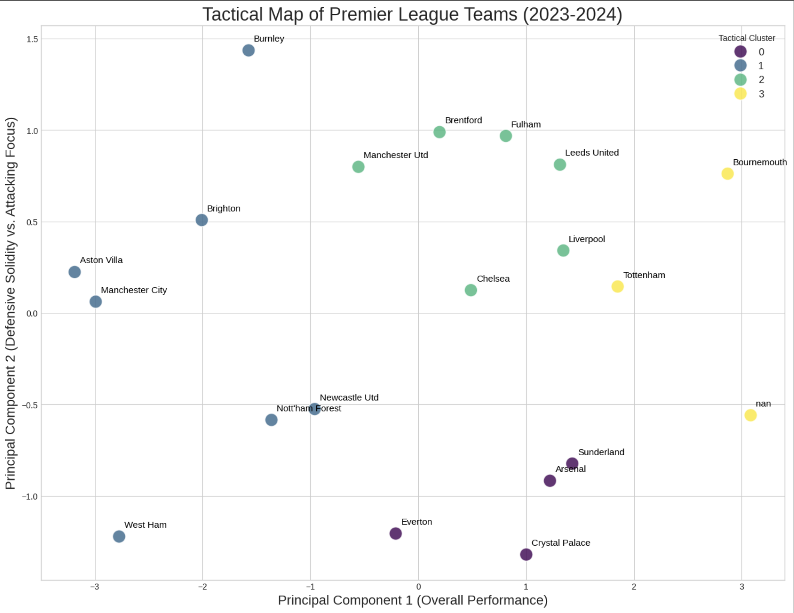

Premier League Team Playstyle Analysis ⚽📊

This project uses unsupervised machine learning to analyze team performance data from the Premier League. The goal is to move beyond simple league standings and identify distinct tactical profiles or "playstyles" of the teams. We use Principal Component Analysis (PCA) for dimensionality reduction and K-Means Clustering to group teams with similar statistical DNA.

🌟 Key Features
Automated Data Collection: Scrapes the latest league data from FBref.

Structured Workflow: The analysis is broken down into a clean, five-notebook pipeline.

Unsupervised Learning: Employs PCA and K-Means to discover hidden patterns without pre-labeled data.

Rich Visualizations: Generates several insightful plots, including:

A 2D "Tactical Map" of all teams.

Radar charts to visualize the "DNA" of each cluster.

Heatmaps and violin plots for deep-dive analysis.

📂 Project Structure
The project is organized into a multi-notebook workflow. It is designed to be run sequentially.

Tactical_Analyst/
│
├── data/                 # Stores all CSV files
│   ├── raw_team_data.csv
│   ├── processed_team_data.csv
│   └── clustered_team_data.csv
│
├── 01_Data_Collection.ipynb        # Scrapes raw data from the web.
├── 02_Data_Preprocessing.ipynb     # Cleans, selects, and scales features.
├── 03_Modeling_PCA_KMeans.ipynb    # Applies PCA and K-Means clustering.
├── 04_Visualization_and_Interpretation.ipynb  # Creates the main tactical map and initial analysis.
├── 05_Deeper_Insights_and_Visualizations.ipynb # Generates advanced visualizations (radars, heatmaps).
└── README.md                       # This file.
🧠 Methodology
Data Scraping: Team-level statistics (Goals For/Against, Expected Goals For/Against, etc.) are scraped from FBref.

Preprocessing: The raw data is cleaned, and the relevant numerical features are scaled using StandardScaler to ensure that each feature contributes equally to the analysis.

Dimensionality Reduction (PCA): We reduce our multiple statistical features into two Principal Components. These two components capture the most variance in the data and can be interpreted as primary axes of playstyle (e.g., "Overall Performance" and "Defensive vs. Attacking Focus").

Clustering (K-Means): Using the PCA-transformed data, the K-Means algorithm groups the 20 teams into a set of distinct clusters. The optimal number of clusters is determined using the Elbow Method.

📈 Visualizations Showcase
This project generates several key visualizations to tell the story of the data.

 The Tactical Map
This scatter plot places each team on a 2D map based on their two principal components and plots them by their assigned cluster. It provides a high-level overview of the tactical landscape of the league.
(You can add a screenshot of your plot here)

🚀 How to Run
To run this project, clone the repository and install the required packages.

1. Clone the repository:

Bash

git clone https://github.com/your-username/Tactical-Analyst.git
cd Tactical-Analyst
2. Create a virtual environment (recommended):

Bash

python -m venv venv
source venv/bin/activate  # On Windows, use `venv\Scripts\activate`
3. Install the dependencies:
Create a requirements.txt file with the following content:

pandas
scikit-learn
matplotlib
seaborn
lxml
Then, install them using pip:

Bash

pip install -r requirements.txt
4. Run the Jupyter Notebooks in order:
Open and run the cells in the notebooks sequentially from 01 to 05.

1.  `01_Data_Collection.ipynb`
2.  `02_Data_Preprocessing.ipynb`
3.  `03_Modeling_PCA_KMeans.ipynb`
4.  `04_Visualization_and_Interpretation.ipynb`
5.  `05_Deeper_Insights_and_Visualizations.ipynb`
📊 Data Source
All data is sourced from FBref. The project is intended for educational purposes only.
